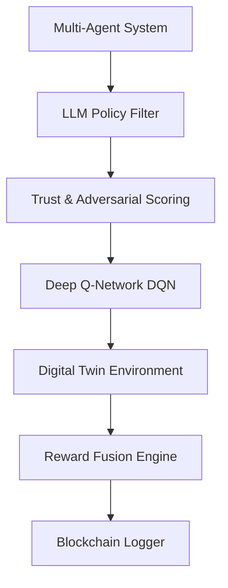

# 🧠 **TrustSpectrumAI: Hybrid AI System for Trust-Aware Reinforcement Learning**

[](https://www.python.org/downloads/)
[](https://opensource.org/licenses/MIT)
[](https://github.com/ZawMyoOoytu/TrustSpectrumAI)

**TrustSpectrumAI** is a research-grade AI simulation framework for decision-making in **adversarial and uncertain environments**. It combines **Deep Reinforcement Learning (DQN)** , **Large Language Model (LLM) policy filtering**, **trust scoring**, **multi-agent systems**, and **blockchain-based verifiable logging** into a unified architecture.

---

## 🚀 **Overview**

Traditional RL agents fail in adversarial environments due to lack of safety awareness. **TrustSpectrumAI** introduces a **trust-aware decision pipeline** that filters, evaluates, and verifies every action before execution.



---

## ✨ **Key Features**

| Component | Description |
|-----------|-------------|
| **🧠 Deep Reinforcement Learning (DQN)** | Learns optimal actions from environment feedback using experience replay |
| **💬 LLM Policy Interpreter** | Filters unsafe/invalid actions and ensures policy compliance |
| **🛡 Trust Engine** | Assigns trust scores and evaluates adversarial risk for every action |
| **⚔️ Adversarial Model (Jammer)** | Simulates attack/interference scenarios to test system robustness |
| **🔗 Blockchain Logger** | Stores every decision as an immutable block for full auditability |
| **🤖 Multi-Agent System** | Generates diverse action proposals to improve exploration |

---

## 📡 **Applications**

| Domain | Use Case |
|--------|----------|
| **📶 5G/6G Spectrum Intelligence** | Dynamic spectrum allocation with trust-aware decisions |
| **🛡 Cybersecurity Defense Systems** | Adaptive threat response with safety validation |
| **🚁 Autonomous Drone Decision Systems** | Safe navigation in contested environments |
| **🏙 Smart City AI Infrastructure** | Trustworthy urban management systems |
| **💰 Fraud Detection Systems** | Risk-aware transaction monitoring |
| **🤖 AI Safety Research** | Building verifiably safe AI systems |

---

## 🧪 **Simulation Environment**

The system runs in a **digital twin network simulator** that models:

- Dynamic state transitions
- Signal interference (jamming)
- Adaptive reward signals
- Multi-agent interactions

### **Example Output**

```
Episode 492
Action: 18
Reward: 0.37
Trust: 0.90
Threat: 0.10
Epsilon: 0.098
Alpha: 1.0
```

---

## 🏗️ **Project Structure**

```
TrustSpectrumAI/
├── main.py                     # Main entry point
├── config/                     # Configuration files
├── rl/                         # Reinforcement Learning module
│   └── dqn.py                  # DQN agent implementation
├── llm/                        # LLM module
│   └── policy_filter.py        # LLM-based action filtering
├── trust/                      # Trust engine module
│   └── trust_scorer.py         # Trust and risk assessment
├── adversarial/                # Adversarial model
│   └── jammer.py               # Signal interference simulation
├── blockchain/                 # Blockchain module
│   └── logger.py               # Immutable decision logging
├── multi_agent/                # Multi-agent system
│   └── agents.py               # Action proposal generation
├── digital_twin/               # Simulation environment
│   └── environment.py          # Digital twin simulator
├── env/                        # Environment wrappers
├── federated/                  # Federated learning components
├── meta/                       # Meta-learning utilities
├── metrics/                    # Performance metrics
├── reward/                     # Reward fusion engine
├── utils/                      # Utilities
└── requirements.txt            # Dependencies
```

---

## 📊 **Research Contributions**

| Contribution | Description |
|--------------|-------------|
| **Hybrid LLM + RL Architecture** | Novel integration of LLM-based filtering with DQN |
| **Trust-Aware RL Mechanism** | Introduces trust scoring to RL decision pipeline |
| **Adversarial-Aware Reward Fusion** | Reward system that accounts for adversarial risks |
| **Blockchain-Based Verifiable AI Logging** | Immutable audit trail for all decisions |
| **Multi-Agent Cooperative Action Generation** | Diverse action proposals for better exploration |

---

## 🚀 **Installation & Setup**

### **Prerequisites**

- Python 3.8+
- pip

### **Installation**

```bash
# Clone the repository
git clone https://github.com/ZawMyoOoytu/TrustSpectrumAI.git
cd TrustSpectrumAI

# Install dependencies
pip install -r requirements.txt
```

### **Run the Project**

```bash
python main.py
```

---

## 📦 **Dependencies**

```txt
numpy>=1.24.0
matplotlib>=3.7.0
# Add PyTorch if DQN uses neural networks
# torch>=2.0.0
```

---

## 🔬 **Future Improvements**

| Feature | Status | Target |
|---------|--------|--------|
| **Replace DQN with Double DQN/PPO** | 📝 | Q3 2026 |
| **Add Real RF Dataset (6G Simulation)** | 📝 | Q4 2026 |
| **Integrate ns-3 Network Simulator** | 📝 | Q4 2026 |
| **Improve Blockchain Security (Merkle Tree)** | 📝 | Q1 2027 |
| **Add Web-Based Training Dashboard (Streamlit)** | 📝 | Q1 2027 |

---

## 🤝 **Contributing**

We welcome contributions! Here's how:

1. **Fork** the repository
2. **Clone** your fork
3. **Create** a feature branch (`git checkout -b feature/AmazingFeature`)
4. **Commit** your changes (`git commit -m 'Add some AmazingFeature'`)
5. **Push** to the branch (`git push origin feature/AmazingFeature`)
6. **Open** a Pull Request

### **Areas for Contribution**

- 🧪 Add more adversarial scenarios
- 📈 Improve trust scoring algorithms
- 🔍 Enhance LLM policy filtering
- 📊 Better visualization and reporting
- 🧠 New RL algorithms integration

---

## 📜 **License**

This project is licensed under the MIT License - see the [LICENSE](LICENSE) file for details.

---

## 👨‍🔬 **Author**

**ZawMyo Oo**

- GitHub: [ZawMyoOoytu](https://github.com/ZawMyoOoytu)
- Website: [zmo-frontend.vercel.app](https://zmo-frontend.vercel.app)

---

## ⭐ **Support the Project**

If you like this project:

- Give it a ⭐ on GitHub
- Contribute improvements
- Share with the community

---

## 📝 **How to Add This README**

```bash
# 1. Create README.md file
# (Copy the content above into README.md)

# 2. Add to Git
git add README.md
git commit -m "Add comprehensive README for TrustSpectrumAI"
git push origin main
```

---

**Building Trustworthy AI Systems** 🔐
